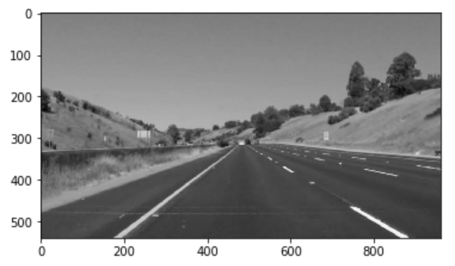
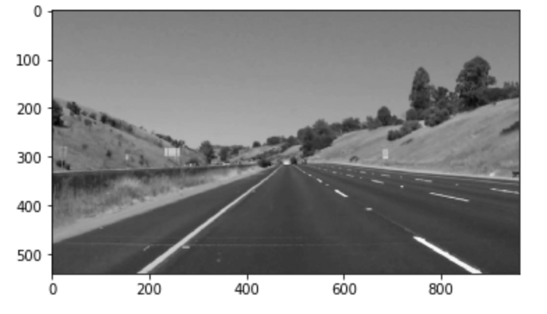
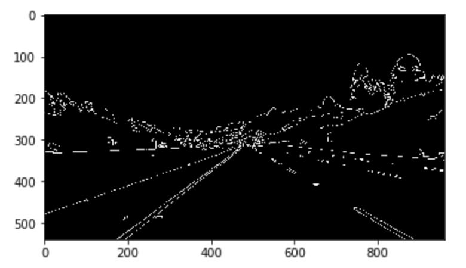
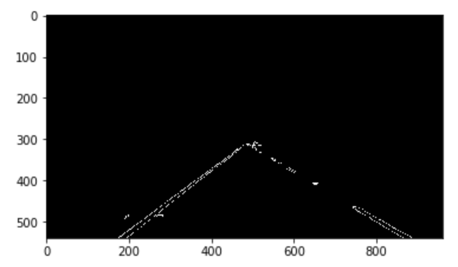
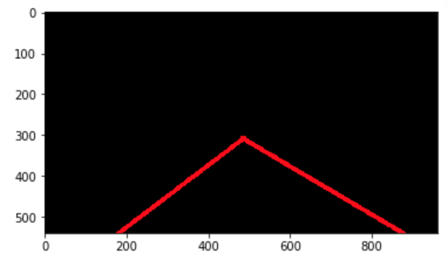
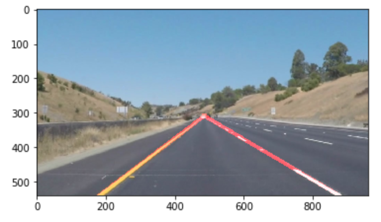

# **Finding Lane Lines on the Road** 

Author: Ricardo Brizido
---

**Finding Lane Lines on the Road**

The goals / steps of this project are the following:
* Make a pipeline that finds lane lines on the road
* Reflect on your work in a written report

[//]: # (Image References)

[image1]: ./examples/grayscale.jpg "Grayscale"

---

### Reflection

### 1. Describe your pipeline. As part of the description, explain how you modified the draw_lines() function.

My pipeline consists in 6 steps as you can find on the code comments:

1) Convert the image to grayscale

2) Apply a Gaussian Blur - even out the noise

3) Apply the algorithm to draw edges in the image - Canny Edge detection

4) Select a region of interest - this will select a triangle on the image and put everything else in black

5) Draw lines - Hough algorithm. This will extrapolate the lines. I have used polyfit to find the polinomial and 
coeficients to then draw 2x single lines. We end up with a black image with the lines drawn in red

6) Overlap the original image with the image calculated in the previous step. 

### 2. Identify potential shortcomings with your current pipeline

Shortcomings on my pipeline:

- The region of interest is hardcoded and doesn't adapt to different videos (camera position in relation to the lane)
- The Hough algorithm parameters are hardcoded - they are set as sensible values but with variations in the line shapes
and type of line (e.g. dashed, double-dashed, etc) the current implementation wouldn't work
- Unsure how it could react on curves, etc

### 3. Suggest possible improvements to your pipeline

Suggested improvements:

- The pipeline could dynamically calculate the region of interest (e.g. averaging out the distance between left and right
lines)
- The pipeline could that into account the camera positioning
